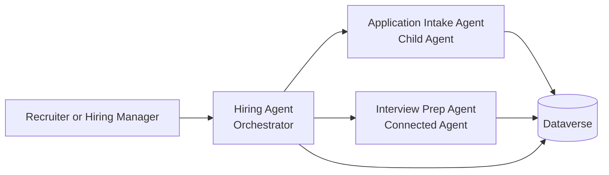

# Copilot Studio Workshop

## Day 2 — Operative Track

### Lab 15 — Multi-Agent Hiring Team

⏱ Estimated time: 40 min

#### Overview
In this lab, you will evolve the Hiring Agent from a single assistant into a coordinated hiring team. You will keep **Hiring Agent** as the orchestrator, add a child **Application Intake Agent** for resume handling, and add a connected **Interview Prep Agent** for interview planning and candidate evaluation support.

#### Prerequisites
1. [Maker] Complete **Lab 13** and **Lab 14** in the same environment.
2. [Maker] Confirm that the **Hiring Agent** exists in the **Operative** solution.
3. [Maker] Confirm that you can create additional agents in Copilot Studio.

#### Step-by-Step Instructions
#### Part 1 — Review the target architecture
Use the following diagram as your target state for this lab.



1. Read the diagram and note that **Hiring Agent** owns the conversation while specialist agents own focused tasks.
2. Keep the diagram visible as you build so you can verify the parent-child and connected-agent relationships.


#### Part 2 — Prepare the Hiring Agent as the orchestrator
1. Open **Hiring Agent** in Copilot Studio.
2. In the **Instructions** card, append this sentence to the end of the existing instructions: `Delegate resume intake tasks to Application Intake Agent and delegate interview preparation tasks to Interview Prep Agent when those specialists are available.`
3. Select **Save**.
4. Open **Settings** and confirm that **Let other agents connect to and use this one** is turned **On**.
5. Select **Save** and return to the agent canvas.

#### Part 3 — Create the Application Intake child agent
1. In **Hiring Agent**, select the **Agents** tab.
2. Select **Add**.
3. In the **Choose how you want to extend your agent** dialog, under **Create a child agent**, select **New child agent**.
4. In **Name**, enter `Application Intake Agent`.
5. In **When will this be used?**, select **The agent chooses**.
6. In **Description**, enter `Processes new resumes, prepares intake summaries, and stores hiring data for the Contoso hiring workflow`.
7. Expand **Advanced**, set **Priority** to `10000`, and turn **Web search** to **Disabled**.
8. Select **Save**.
9. In the child agent **Instructions** area, enter the following text and then select **Save**:

```text
You are Application Intake Agent.
Handle new resume intake, collect missing candidate details, and prepare concise summaries for the Hiring Agent.
Stay focused on intake tasks only.
If the recruiter asks for interview planning or evaluation guidance, tell Hiring Agent to route the request to Interview Prep Agent.
```

#### Part 4 — Create the Interview Prep connected agent
1. Select **Agents** in the left navigation and then select **Create blank agent**.
2. Use **Advanced create** and create a second agent in the **Operative** solution.
3. Rename the new agent to `Interview Prep Agent`.
4. Set the description to `Creates interview question sets, evaluation rubrics, and recruiter-ready interview guidance for the Contoso hiring process`.
5. Open **Settings** for **Interview Prep Agent** and turn **Let other agents connect to and use this one** to **On**.
6. Turn **Use general knowledge** to **Off** and **Use information from the web** to **Off** so the agent relies on business data and workshop guidance.
7. In the **Instructions** card, paste the following text and save it:

```text
You are Interview Prep Agent.
Help with interview guides, structured questions, evaluation criteria, and candidate debrief preparation.
Keep responses professional and job-related.
Do not answer questions about protected characteristics, private personal matters, or non-hiring topics.
```

8. In **Knowledge**, select **+ Add knowledge**, choose **Dataverse**, and add the **Job Role** and **Evaluation Criteria** tables from the Operative solution so this agent can answer from live hiring data.

> Note: If your environment already exposes the hiring tables from the imported solution, use those records so the connected agent answers from live hiring data rather than static examples.

#### Part 5 — Connect the Interview Prep Agent to Hiring Agent
1. Open **Interview Prep Agent** and confirm it has been saved. You do not need to publish to a channel for connected-agent discovery within the same environment — saving is sufficient. If you have made any changes, select **Save** now.
2. Return to **Hiring Agent**.
3. Open the **Agents** tab and select **Add**.
4. In the **Choose how you want to extend your agent** dialog, scroll to **Select an agent in your environment**.
5. Select **Interview Prep Agent** from the agent list. If it does not appear, select the **Connected agents** filter tab or use the search box.
6. In the connection configuration, enter the description `Use for interview guide creation, interview questions, and evaluation support`.
7. Select **Add and configure**.
8. Save the updated **Hiring Agent**.

#### Part 6 — Test delegation behavior
1. Start a **New test session** in **Hiring Agent**.
2. Ask the agent to help process a newly received resume and confirm that the response routes the intake work toward **Application Intake Agent**.
3. Ask the agent to generate interview questions for a Contoso job role and confirm that the response routes interview planning to **Interview Prep Agent**.
4. Review the **Activity map** to confirm that the orchestrator and specialist paths are visible.


#### Validation
1. **Hiring Agent** still exists as the main agent and includes delegation language in its instructions.
2. **Application Intake Agent** appears as a child agent under **Hiring Agent**.
3. **Interview Prep Agent** exists as a separate agent and is configured to allow connections.
4. **Hiring Agent** shows **Interview Prep Agent** as a connected agent.
5. A test session shows clear routing or delegation behavior for both intake and interview-prep requests.

#### Troubleshooting
1. If the connected agent does not appear in the picker, save and publish it, then refresh the **Hiring Agent** page.
2. If the orchestrator handles every request itself, strengthen the descriptions and instructions so the specialist purpose is clearer.
3. If both agents answer the same type of request, tighten the wording so **Application Intake Agent** owns intake and **Interview Prep Agent** owns interview preparation.
4. If the **Activity map** is empty, start a new test session after saving your configuration changes.

#### Facilitator Notes
1. Explain why the intake specialist is a child agent and the interview specialist is a connected agent.
2. Call out that this lab establishes the collaboration pattern used in later labs for automation, grounding, and document generation.
3. If participants are short on time, pre-create the connected agent and let them focus on descriptions, instructions, and validation.

