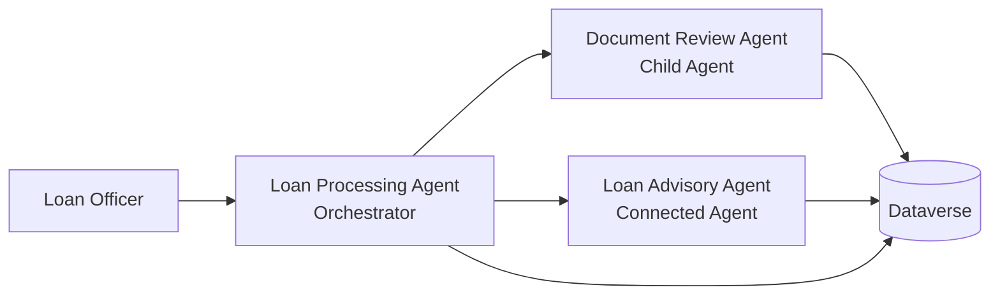

# Copilot Studio Workshop

## Day 2 — Enterprise Track

### Lab 15 — Multi-Agent Orchestration

⏱ Estimated time: 40 min

#### Overview
In this lab, you will evolve the Loan Processing Agent from a single assistant into a coordinated lending team. You will keep **Loan Processing Agent** as the orchestrator, add a child **Document Review Agent** for financial document handling, and add a connected **Loan Advisory Agent** for loan assessment and applicant evaluation support.

#### Prerequisites
1. [Maker] Complete **Lab 13** and **Lab 14** in the same environment.
2. [Maker] Confirm that the **Loan Processing Agent** exists in the **WoodgroveLending** solution.
3. [Maker] Confirm that you can create additional agents in Copilot Studio.

#### Step-by-Step Instructions
#### Part 1 — Review the target architecture
Use the following diagram as your target state for this lab.



1. Read the diagram and note that **Loan Processing Agent** owns the conversation while specialist agents own focused tasks.
2. Keep the diagram visible as you build so you can verify the parent-child and connected-agent relationships.


#### Part 2 — Prepare the Loan Processing Agent as the orchestrator
1. Open **Loan Processing Agent** in Copilot Studio.
2. In the **Instructions** card, append this sentence to the end of the existing instructions: `When a loan officer asks to review financial documents or extract data from uploaded files, delegate to the Document Review Agent. When a loan officer asks for an assessment recommendation or wants to evaluate an applicant's eligibility, delegate to the Loan Advisory Agent.`
3. Select **Save**.
4. Open **Settings** and confirm that **Let other agents connect to and use this one** is turned **On**.
5. Select **Save** and return to the agent canvas.

#### Part 3 — Create the Document Review child agent
1. In **Loan Processing Agent**, select the **Agents** tab.
2. Select **Add**.
3. In the **Choose how you want to extend your agent** dialog, under **Create a child agent**, select **New child agent**.
4. In **Name**, enter `Document Review Agent`.
5. In **When will this be used?**, select **The agent chooses**.
6. In **Description**, enter `Analyzes uploaded financial documents such as pay stubs, tax returns, and bank statements. Extracts key financial data and flags inconsistencies.`
7. Expand **Advanced**, set **Priority** to `10000`, and turn **Web search** to **Disabled**.
8. Select **Save**.
9. In the child agent **Instructions** area, enter the following text and then select **Save**:

```text
You are Document Review Agent.
Analyze uploaded financial documents, extract key financial data, and flag inconsistencies for the Loan Processing Agent.
Stay focused on document review tasks only.
If the loan officer asks for an assessment recommendation or eligibility evaluation, tell Loan Processing Agent to route the request to Loan Advisory Agent.
```

#### Part 4 — Create the Loan Advisory connected agent
1. Select **Agents** in the left navigation and then select **Create blank agent**.
2. Use **Advanced create** and create a second agent in the **WoodgroveLending** solution.
3. Rename the new agent to `Loan Advisory Agent`.
4. Set the description to `Reviews applicant profiles against assessment criteria for the requested loan type. Provides a preliminary recommendation with supporting rationale.`
5. Open **Settings** for **Loan Advisory Agent** and turn **Let other agents connect to and use this one** to **On**.
6. Turn **Use general knowledge** to **Off** and **Use information from the web** to **Off** so the agent relies on business data and workshop guidance.
7. In the **Instructions** card, paste the following text and save it:

```text
You are Loan Advisory Agent.
Help with loan assessments, eligibility evaluations, assessment criteria reviews, and preliminary lending recommendations.
Keep responses professional and focused on lending data.
Do not answer questions about personal financial advice, competitor products, or non-lending topics.
```

8. In **Knowledge**, select **+ Add knowledge**, choose **Dataverse**, and add the **Loan Type** and **Assessment Criteria** tables from the WoodgroveLending solution so this agent can answer from live lending data.

> Note: If your environment already exposes the lending tables from the imported solution, use those records so the connected agent answers from live lending data rather than static examples.

#### Part 5 — Connect the Loan Advisory Agent to Loan Processing Agent
1. Open **Loan Advisory Agent** and confirm it has been saved. You do not need to publish to a channel for connected-agent discovery within the same environment — saving is sufficient. If you have made any changes, select **Save** now.
2. Return to **Loan Processing Agent**.
3. Open the **Agents** tab and select **Add**.
4. In the **Choose how you want to extend your agent** dialog, scroll to **Select an agent in your environment**.
5. Select **Loan Advisory Agent** from the agent list. If it does not appear, select the **Connected agents** filter tab or use the search box.
6. In the connection configuration, enter the description `Use for loan assessments, eligibility evaluations, and preliminary lending recommendations`.
7. Select **Add and configure**.
8. Save the updated **Loan Processing Agent**.

#### Part 6 — Test delegation behavior
1. Start a **New test session** in **Loan Processing Agent**.
2. Ask the agent to help review a newly uploaded financial document and confirm that the response routes the document review work toward **Document Review Agent**.
3. Ask the agent to evaluate an applicant's eligibility for a Woodgrove Bank loan type and confirm that the response routes the assessment to **Loan Advisory Agent**.
4. Review the **Activity map** to confirm that the orchestrator and specialist paths are visible.


#### Validation
1. **Loan Processing Agent** still exists as the main agent and includes delegation language in its instructions.
2. **Document Review Agent** appears as a child agent under **Loan Processing Agent**.
3. **Loan Advisory Agent** exists as a separate agent and is configured to allow connections.
4. **Loan Processing Agent** shows **Loan Advisory Agent** as a connected agent.
5. A test session shows clear routing or delegation behavior for both document review and loan advisory requests.

#### Troubleshooting
1. If the connected agent does not appear in the picker, save and publish it, then refresh the **Loan Processing Agent** page.
2. If the orchestrator handles every request itself, strengthen the descriptions and instructions so the specialist purpose is clearer.
3. If both agents answer the same type of request, tighten the wording so **Document Review Agent** owns document analysis and **Loan Advisory Agent** owns loan assessments.
4. If the **Activity map** is empty, start a new test session after saving your configuration changes.

#### Facilitator Notes
1. Explain why the document review specialist is a child agent and the loan advisory specialist is a connected agent.
2. Call out that this lab establishes the collaboration pattern used in later labs for automation, grounding, and document generation.
3. If participants are short on time, pre-create the connected agent and let them focus on descriptions, instructions, and validation.
